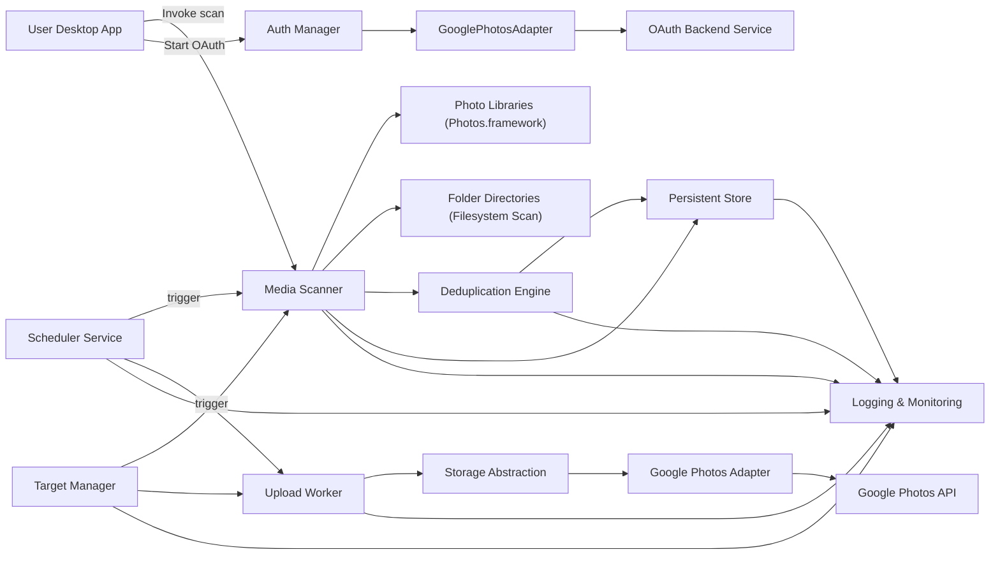
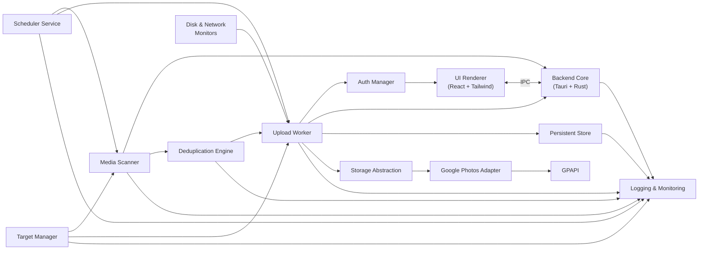
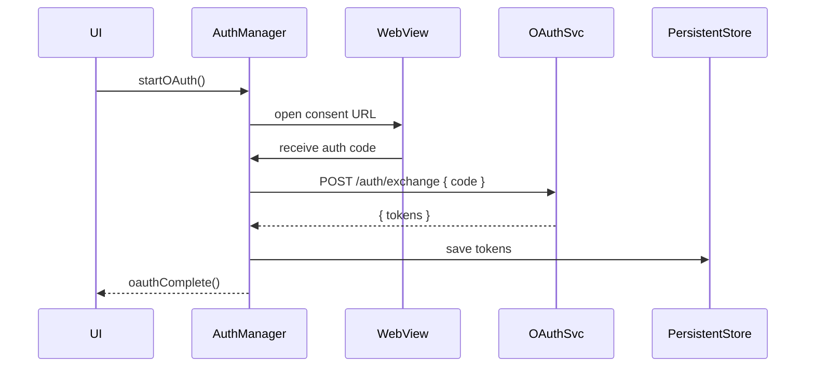
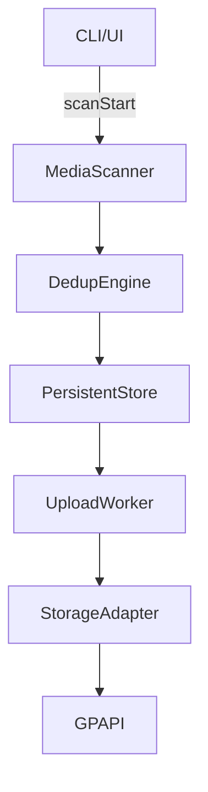
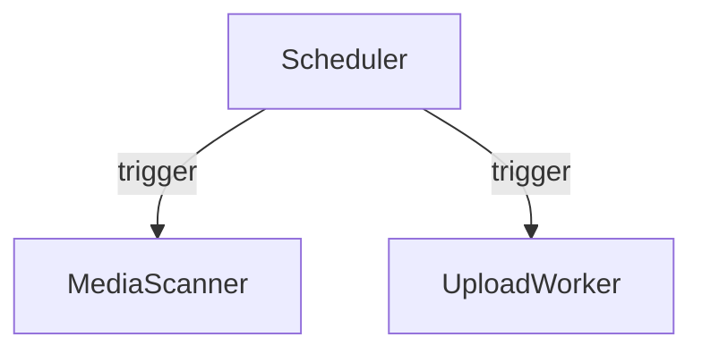

# Technical Design Document (High‑Level Design)
**Project:** Photo Migrator  
**Version:** 1.0.0  
**Author:** Sku Soda  
**Date:** April 20, 2025  

---

## Table of Contents
1. [Purpose & Scope](#purpose--scope)  
2. [Architecture Overview](#architecture-overview)  
   1. [System Context](#system-context)  
   2. [Component Diagram](#component-diagram)  
3. [Module Descriptions](#module-descriptions)  
   1. [Media Scanner](#1-media-scanner)  
   2. [Upload Worker](#2-upload-worker)  
   3. [Auth Manager](#3-auth-manager)  
   4. [Persistent Store](#4-persistent-store)  
   5. [Settings Manager](#5-settings-manager)  
   6. [Disk & Network Monitors](#6-disk--network-monitors)  
   7. [UI Renderer](#7-ui-renderer)  
   8. [CLI Interface](#8-cli-interface)  
   9. [Deduplication Engine](#3.9-deduplication-engine)  
   10. [Logging & Monitoring](#3.10-logging--monitoring)  
   11. [Scheduler](#3.11-scheduler)  
   12. [Target Manager](#3.12-target-manager)  
   13. [Storage Abstraction Layer](#3.13-storage-abstraction-layer)  
4. [Data Design](#data-design)  
   1. [Logical Schema](#4.1-logical-schema)  
   2. [Configuration Export](#4.2-configuration-export)  
5. [Interface Specifications](#interface-specifications)  
   1. [Internal Backend ↔ UI IPC](#5.1-internal-backend--ui-ipc)  
   2. [Backend ↔ OAuth Service API](#5.2-backend--oauth-service-api)  
   3. [CLI Contracts](#5.3-cli-contracts)  
6. [Key Sequence Flows](#key-sequence-flows)  
   1. [OAuth2 Login](#6.1-oauth2-login)  
   2. [Scan → Upload](#6.2-scan--upload)  
   3. [Scheduled Sync](#6.3-scheduled-sync)  
7. [Non‑Functional Requirements](#7-non-functional-requirements)  
8. [Security Considerations](#8-security-considerations)  
9. [Deployment & Packaging](#9-deployment--packaging)  
10. [Dependencies & Constraints](#10-dependencies--constraints)  
11. [Glossary](#11-glossary)  

---

## 1. Purpose & Scope
This document provides a **High‑Level Design** for the Photo Migrator application, translating the PRD/FSD into an architectural blueprint that guides implementation. It defines modules, their interactions, data flows, and interfaces.

**In Scope:**  
- Desktop application (macOS & Windows) built with Tauri (Rust + WebView).  
- Headless CLI.  
- Secure OAuth2 via lightweight backend.  
- Local persistence (SQLite).  

**Out of Scope:**  
- Mobile clients, media editing, non‑Google destinations, transcoding.  

---

## 2. Architecture Overview  

### 2.1 System Context  


### 2.2 Component Diagram  

---

## 3. Module Descriptions  

### 3.1 Media Scanner  
- **Language:** Rust + SwiftBridge (macOS)  
- **Responsibility:**  
  - Discover files via Photos.framework (photo libraries) and filesystem scan (whitelisted folder directories).  
  - Extract metadata (EXIF, MIME, hash, duration).  
  - Batch cloud‑only downloads in rolling window.  
  - Accept target definitions (libraries and folders) from Target Manager.  
  - Persist entries to SQLite.  

### 3.2 Upload Worker Upload Worker  
- **Language:** Rust  
- **Responsibility:**  
  - Consume batches from DB or triggered by Scheduler.  
  - Resumable uploads via Storage Abstraction.  
  - Deduplication by `sha256_hash`.  
  - Retry with exponential backoff.  
  - Update status & remote IDs.  

### 3.3 Auth Manager  
- **Language:** Rust + Tauri WebView  
- **Responsibility:**  
  - OAuth2 consent flows.  
  - Persist tokens to Persistent Store.  

### 3.4 Persistent Store  
- **Library:** rusqlite  
- **Responsibility:**  
  - Schema migrations  
  - Tables for media_items, batches, settings, migrations, sync_targets, schedules.  

### 3.5 Settings Manager  
- **Language:** Rust  
- **Responsibility:**  
  - Manage key/value configs, including sync frequency, whitelist/blacklist.  
  - Provide configs to Scheduler and Target Manager.  

### 3.6 Disk & Network Monitors  
- **Crates:** sysinfo, tauri-network  
- **Responsibility:**  
  - Enforce thresholds and detect connectivity changes.  

### 3.7 UI Renderer  
- **Tech:** React, Tailwind, Tauri WebView  
- **Responsibility:**  
  - Display progress, settings, logs, and manual controls (pause/resume).  
  - Expose scheduling and target management UI.  

### 3.8 CLI Interface  
- **Language:** Rust  
- **Responsibility:**  
  - Commands: `scan`, `plan`, `upload`, `resume`, `schedule`, `list-targets`, `add-target`, `remove-target`.  
  - Output JSON; exit codes.  

### 3.9 Deduplication Engine  
- **Language:** Rust  
- **Responsibility:**  
  - Content and metadata dedup as defined.  
  - IPC: `findDuplicates`, `groupDuplicates`, `selectCanonical`.  

### 3.10 Logging & Monitoring  
- **Language:** Rust  
- **Responsibility:**  
  - Central logging, metrics (Prometheus), health checks.  

### 3.11 Scheduler  
- **Language:** Rust  
- **Responsibility:**  
  - Configure cron-like schedules for automatic sync.  
  - Trigger scan/upload workflows based on config.  

### 3.12 Target Manager  
- **Language:** Rust  
- **Responsibility:**  
  - Define and manage sync targets (Photo libraries and folder paths).  
  - Support whitelist and blacklist overrides.  

### 3.13 Storage Abstraction Layer  
- **Language:** Rust  
- **Responsibility:**  
  - Define generic trait/adapter interface for cloud providers.  
  - Implement Google Photos adapter now; plan for S3, B2, Azure.  
  
  - **Destination Configuration:** Accept provider-specific destination settings (e.g., Google Photos `collectionId`, S3 `bucket`+`prefix`, Backblaze B2 `bucketId`).  
  - **API:**  
    - `uploadFile(file, metadata, destinationConfig)`  
    - `createCollection(name, destinationConfig)`  
    - `configureDestination(providerConfig) -> DestinationConfig`  
    - `getQuota()`  

---

## 4. Data Design  

### 4.1 Logical Schema Update  
| Table            | Key Fields / Columns                                                                                                           |  
|------------------|--------------------------------------------------------------------------------------------------------------------------------|  
| **media_items**  | `id`, `media_type`, `mime_type`, `original_path`, `sha256_hash`, `status` ⏐ INDEX(`sha256_hash`), FOREIGN KEY(`status`) REFERENCES `batches`(`status`) |  
| **batches**      | `id`, `created_at`, `status`, `total_size`, `file_count` ⏐ INDEX(`status`)                                                         |  
| **settings**     | `key`, `value`                                                                                                                 |  
| **sync_targets** | `id`, `path`, `type` (library|folder), `whitelist` (bool), `blacklist` (bool)                                                    |  
| **schedules**    | `id`, `cron_expr`, `enabled`                                                                                                   |  
| **cloud_configs**| `id`, `provider` (google_photos|s3|b2|azure), `config` (JSON blob of destinationConfig and auth details)                    |  
| **migrations**   | `id`, `applied_at`, `description`                                                                                              |  

### 4.2 Configuration Export  
```json
{
  "disk_usage_cap_gb": 80,
  "upload_concurrency": 4,
  "bandwidth_limit_mbps": 5,
  "wifi_only": true,
  "skip_icloud_only": false,
  "sync_frequency": "0 * * * *",
  "targets": [
    {"path": "/Users/joe/Pictures/Library.photoslibrary", "type": "library"}
  ],
  "blacklist": [
    {"path": "/Users/joe/Pictures/Library.photoslibrary/Masters"}
  ]
}
```

### 4.3 Google Photos CloudConfig Format  
For `provider = "google_photos"`, the `config` JSON blob should include:

```json
{
  "provider": "google_photos",
  "destinationConfig": {
    "collectionId": "YOUR_ALBUM_ID"  // ID of existing Google Photos album, or omit to create new
  },
  "auth": {
    "accessToken": "ya29.a0AfH6SMA...",
    "refreshToken": "1//0g...",
    "expiresIn": 3600
  }
}
```

- **destinationConfig.collectionId**: (string) Optional. If provided, uploaded media will go into this album. If omitted, a new album with the configured name will be created on first use.
- **auth**: Contains OAuth2 tokens obtained via the Auth Manager.  json
{
  "disk_usage_cap_gb": 80,
  "upload_concurrency": 4,
  "bandwidth_limit_mbps": 5,
  "wifi_only": true,
  "skip_icloud_only": false,
  "sync_frequency": "0 * * * *",
  "targets": [{"path": "/Users/joe/Pictures/Library.photoslibrary", "type": "library"}],
  "blacklist": [{"path": "/Users/joe/Pictures/Library.photoslibrary/Masters"}]
}
```

---

## 5. Interface Specifications  

### 5.1 Internal Backend ↔ UI IPC  
- **Protocol:** Tauri command/event system  
- **Commands:**  
  - Core: `scanStart`, `scanProgress`, `scanComplete`, `uploadStart`, `uploadProgress`, `uploadComplete`  
  - Config: `getSettings`, `setSettings`, `getTargets`, `addTarget`, `removeTarget`, `getSchedule`, `setSchedule`  
  - Dedup: `findDuplicates`, `groupDuplicates`, `selectCanonical`  
  - Storage: `uploadFile`, `createCollection`, `getQuota`  
  - CloudConfig: `getCloudConfigs()`, `addCloudConfig(providerConfig)`, `updateCloudConfig(id, providerConfig)`, `removeCloudConfig(id)`  

### 5.2 Backend ↔ OAuth Service API  
| Endpoint           | Method | Payload                                    | Response                                      |
|--------------------|--------|--------------------------------------------|-----------------------------------------------|
| `/auth/exchange`   | POST   | `{ code, redirect_uri }`                   | `{ access_token, refresh_token, expires_in }` |
| `/auth/refresh`    | POST   | `{ refresh_token }`                        | `{ access_token, expires_in }`                |

### 5.3 CLI Contracts  
```bash
photo-migrator scan
photo-migrator plan
photo-migrator upload
photo-migrator resume
photo-migrator schedule --cron "0 * * * *"
photo-migrator list-targets
photo-migrator add-target --path "/path/to/folder" --type folder
photo-migrator remove-target --id <target_id>
photo-migrator list-configs
photo-migrator add-config --provider <provider> --config '<JSON blob with provider-specific destination and auth settings>'
photo-migrator update-config --id <config_id> --config '<JSON blob with updated destination or auth fields>'
photo-migrator remove-config --id <config_id>
```  

---

## 6. Key Sequence Flows  

### 6.1 OAuth2 Login  


### 6.2 Scan → Upload  


### 6.3 Scheduled Sync  


---

## 7. Non‑Functional Requirements  
- **Performance:** ≥10 MB/s throughput.  
- **Reliability:** ≥99% first‑attempt success.  
- **Resource Usage:** Temp ≤80% cap; RAM idle ≤200 MB.  
- **Scalability:** 100 K items.  
- **Maintainability:** 90%+ unit tests; CI gates.  
- **Observability SLAs:** Log latency <100 ms; metrics ≥1/s/module.  

---

## 8. Security Considerations  
- **OAuth Secrets:** Backend-only.  
- **Token Storage:** Encrypted at rest.  
- **Logging:** No PII.  
- **Telemetry:** Opt-in only.  

---

## 9. Deployment & Packaging  
- **Desktop App:** Tauri Bundler → native .app/.exe; auto-update via Tauri Updater/S3.  
- **Backend:** Docker; AWS/GCP/Azure; TLS.  

---

## 10. Dependencies & Constraints  
- Rust ≥1.60, Tauri ≥1.0, Swift ≥5, SQLite 3.x, oauth2 crate ≥4.x.  
- Handle API quotas.  
- iCloud client installed.  

---

## 11. Glossary  
- **Batch:** Group of media items.  
- **Deduplication Engine:** Identifies duplicates.  
- **Scheduler:** Cron-based trigger service.  
- **Target Manager:** Manages sync targets (libraries/folders).  
- **Storage Abstraction:** Adapter interface for cloud providers.  
- **DuplicateGroup:** Set of duplicate files.  
- **pHash:** Perceptual hash algorithm.  
- **Hamming distance:** Bitwise difference metric.  
- **Observability:** System health via logs & metrics.  
- **Rolling‑Window Download:** Chunked download.  
- **Resumable Upload:** Chunked Google API upload.  
- **Staging Folder:** Temporary export area.  
- **Tauri:** Rust + WebView desktop framework.  

