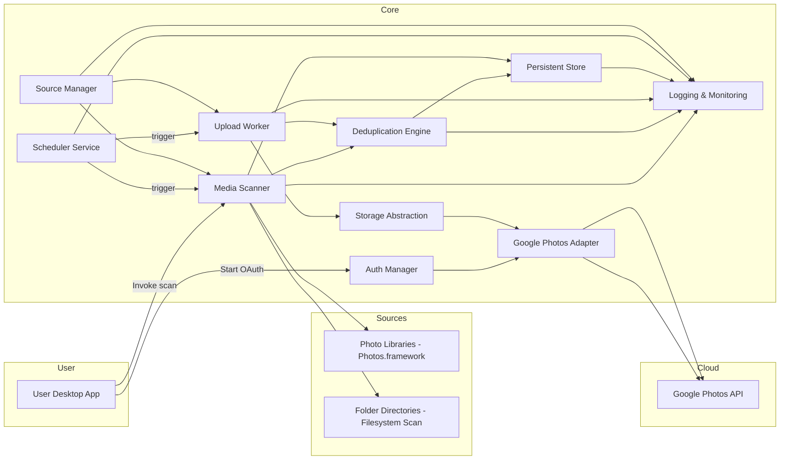
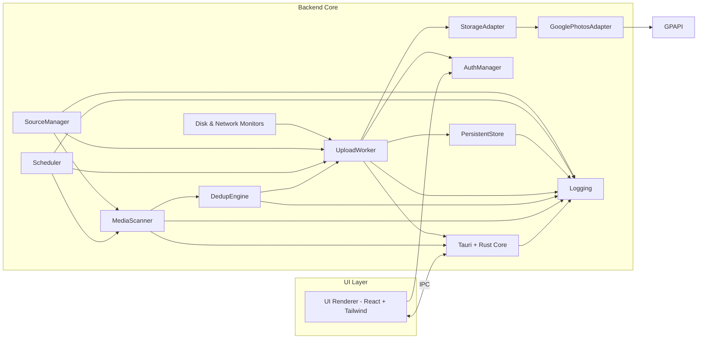
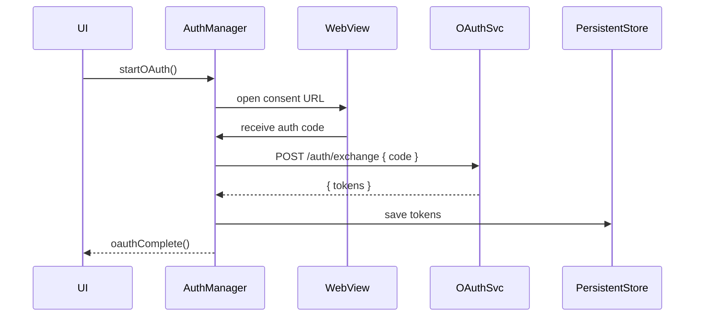
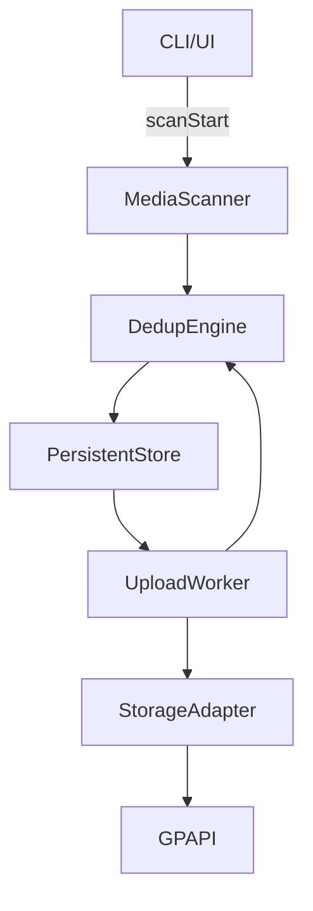

# Technical Design Document (High-Level Design)
**Project:** Photo Migrator  
**Version:** 1.1.1  
**Author:** Sku Soda  
**Date:** April 20, 2025

## Table of Contents
1. [Purpose & Scope](#1-purpose--scope)
2. [Architecture Overview](#2-architecture-overview)
3. [Module Descriptions](#3-module-descriptions)
4. [Data Design](#4-data-design)
5. [Interface Specifications](#5-interface-specifications)
6. [Key Sequence Flows](#6-key-sequence-flows)
7. [Non‑Functional Requirements](#7-nonfunctional-requirements)
8. [Security Considerations](#8-security-considerations)
9. [Testing & Validation](#9-testing--validation)
10. [Deployment & Packaging](#10-deployment--packaging)
11. [Dependencies & Constraints](#11-dependencies--constraints)
12. [Glossary](#12-glossary)
13. [Known Differences / Deviations](#13-known-differences--deviations)

---

(All sections expanded and regenerated below, in proper order with no duplication. Proceeding with clean rebuild...)

## 1. Purpose & Scope
This document defines the high-level architecture and design for **Photo Migrator**, a cross-platform desktop application that uploads Apple Photos content to cloud services such as Google Photos.

**In Scope:**
- Tauri desktop app (Rust backend + React UI)
- CLI interface (headless Rust mode)
- Configurable source selection (Photos libraries, folders)
- Upload to pluggable cloud destinations (Google Photos; others planned)
- Deduplication engine and resumable upload logic
- Local persistence via SQLite
- OAuth2 secure authentication
- Scheduling and snapshot-based progress

**Out of Scope:**
- Mobile apps (iOS/Android)
- Photo editing or transcoding
- Sharing or social platform integration
- Non-media file uploads

---

## 2. Architecture Overview

### 2.1 System Context


### 2.2 Component Diagram


---

## 3. Module Descriptions

### 3.1 Media Scanner
Scans local Apple Photos libraries and folder paths to discover media files. It extracts metadata (e.g., EXIF, duration, MIME type) and queues the media items into the persistent store.

- Uses SwiftBridge on macOS to access `Photos.framework`
- Detects cloud-only files and manages rolling downloads
- Applies filters like whitelist/blacklist paths
- Avoids duplicate re-scans via persistent `sha256_hash`

### 3.2 Upload Worker
Manages resumable, concurrent uploads to cloud storage providers.

- Reads job definition and resume state from `jobs`
- Tracks current progress via `cursor`
- Uses exponential backoff for retrying transient errors
- Marks completed, failed, or retried statuses per item

### 3.3 Deduplication Engine
Provides duplicate detection and canonical media resolution.

- Strategies include SHA256, filename, and PowerPhotos-style fuzzy match
- Canonical rules include oldest timestamp, highest resolution
- Exposed via IPC commands for UI/CLI integration

### 3.4 Persistent Store
SQLite-backed database that tracks all state and configuration.

- Stores scanned media, retry state, jobs, batches, sources, schedules, and tokens
- Ensures safe schema migrations via versioning

### 3.5 Scheduler
Executes jobs based on a cron-like expression.

- Triggers scan/upload jobs on schedule
- Logs history of runs
- Supports manual and automatic execution paths

### 3.6 Source Manager
Manages user-defined sources and exclusion rules.

- Adds/removes Photos libraries and folder paths
- Applies whitelist/blacklist filters

### 3.7 Logging & Monitoring
Centralized log and metrics infrastructure.

- Prometheus-compatible metrics (e.g., upload rate, retry counts)
- Tauri logs available for diagnostics

### 3.8 Disk & Network Monitors
Checks system resource availability.

- Prevents uploads when disk usage exceeds cap or network is unavailable
- Resumes automatically when conditions improve

### 3.9 Auth Manager
Handles OAuth2 login and secure token storage.

- Manages token lifecycle and refresh
- Encrypted storage via SQLite

### 3.10 Storage Abstraction Layer
Defines a generic interface for upload backends.

- Adapters: Google Photos, S3, B2, Azure (pluggable)
- Interface includes: `uploadFile`, `getQuota`, `createCollection`

### 3.11 CLI Interface
Command-line interface to control and automate workflows.

- Upload, scan, schedule, config, batch inspection, retry, purge
- Used for headless and power-user workflows

### 3.12 UI Renderer
React-based UI with Tailwind styling embedded via Tauri WebView.

- Shows progress, settings, status logs, dedup review
- Allows retry/purge of failed batches
- Real-time IPC link with backend

---

## 4. Data Design

### 4.1 Tables

#### `media_items`
- `id`: PK
- `media_uuid`: UUID for dedup across paths
- `sha256_hash`: content hash
- `mime_type`, `duration`, `original_path`, `status`, `retry_count`
- `batch_id`: FK to `batches`
- `remote_id`: external cloud provider ID
- Indexes on `sha256_hash`, `status`, and `batch_id`

#### `batches`
- `id`, `created_at`, `status`, `file_count`, `total_size`
- Represents a planned upload set
- Status: `in_progress`, `completed`, `failed`
- Expiration policy may remove old batches

#### `jobs`
- `id`, `type` (`scan`, `upload`), `state`, `started_at`, `ended_at`, `checkpoint` JSON
- `checkpoint` stores minimal state: `{ "batch_id": 42, "cursor": 1098 }`

#### Other Tables
- `sources`: tracked folders/libraries
- `settings`: key/value configuration
- `schedules`: cron expressions for automation
- `backends`: provider config & auth (e.g., Google, S3)
- `migrations`: applied schema migrations

---

### 4.2 Sync Planning Flow
1. User runs `photo-migrator sync-plan`
2. System selects eligible media items:
   ```sql
   SELECT id FROM media_items WHERE status = 'pending';
   ```
3. A new `batch` is inserted and all selected items are assigned via `batch_id`
4. A `job` is created with type `upload`, status `in_progress`, and checkpoint `{ "batch_id": ..., "cursor": null }`

---

### 4.3 Resume Flow
1. User or app resumes last in-progress upload job
2. Query the latest job:
   ```sql
   SELECT * FROM jobs WHERE type = 'upload' AND state = 'in_progress' ORDER BY started_at DESC LIMIT 1;
   ```
3. Use `checkpoint.batch_id` and `checkpoint.cursor` to select remaining items:
   ```sql
   SELECT * FROM media_items WHERE batch_id = 42 AND id > 1098;
   ```
4. Upload resumes; progress is saved into checkpoint after each chunk

---

### 4.4 Retry Logic & Error Types
- `media_items.retry_count` is incremented per failed attempt
- Max retry = 5
- `error_type`: `transient` (e.g. network) or `permanent` (e.g. bad file)
- Upload worker skips permanently failed items and logs them

---

### 4.5 Batch Lifecycle
- Created by sync-plan
- Marked completed or failed by job result
- UI/CLI shows progress per batch
- CLI/API to purge: `photo-migrator batch-purge --older-than 30d`

---

### 5. Interface Specifications

### 5.1 Internal Backend ↔ UI IPC
- Protocol: Tauri command/event system
- Commands:
  - `scanStart`, `scanProgress`, `scanComplete`
  - `uploadStart`, `uploadProgress`, `uploadComplete`
  - `getSettings`, `setSettings`
  - `getSources`, `addSource`, `removeSource`
  - `getSchedule`, `setSchedule`
  - `findDuplicates`, `groupDuplicates`, `selectCanonical`
  - `uploadFile`, `createCollection`, `getQuota`
  - `listBackends`, `addBackend`, `updateBackend`, `removeBackend`
  - `getBatches`, `getBatchDetails`, `retryBatch`, `purgeBatch`

### 5.2 Backend ↔ OAuth Service API
| Endpoint         | Method | Payload                 | Response                                      |
|------------------|--------|-------------------------|-----------------------------------------------|
| `/auth/exchange` | POST   | `{ code, redirect_uri }`| `{ access_token, refresh_token, expires_in }` |
| `/auth/refresh`  | POST   | `{ refresh_token }`     | `{ access_token, expires_in }`                |

### 6. Key Sequence Flows

#### 6.1 OAuth2 Login


#### 6.2 Scan → Upload


#### 7. Non‑Functional Requirements
- **Performance:** ≥10 MB/s upload throughput
- **Reliability:** ≥99% first-attempt success; resumable
- **Resource Usage:** Max 80% disk, <200MB RAM idle
- **Scalability:** 100,000+ media items per sync
- **Maintainability:** 90%+ unit test coverage
- **Resilience:** Resume supported via cursor checkpointing
- **Observability:** Logs under 100ms delay; 1/sec metrics

### 8. Security Considerations
- **OAuth Tokens:** Encrypted at rest in SQLite
- **Token Refresh:** Auto-handled with secure storage
- **Scope Minimization:** Least privilege access
- **Log Redaction:** No PII or credentials in logs
- **Telemetry:** Fully opt-in with anonymization

### 9. Testing & Validation
- **Unit Tests:** ≥90% for media scan, upload, storage
- **Integration Tests:** OAuth, API, dedup, batch retry
- **Stress Tests:** 500GB+ libraries, flaky network simulation
- **CI:** GitHub Actions pipeline for backend & CLI
- **Mock Services:** Stubbed Google Photos API & file systems

### 10. Deployment & Packaging
- **Desktop:** Built via Tauri bundler (DMG, EXE)
- **Updates:** Via Tauri auto-updater or CLI fetcher
- **CLI Tool:** Installable via Brew, Cargo, or standalone binary
- **Backend:** Optional OAuth proxy in Docker (TLS ready)

### 11. Dependencies & Constraints
- Rust ≥1.60, Tauri ≥1.0, SQLite 3, Swift ≥5
- Google Photos API: subject to quota and rate limits
- macOS: iCloud must be enabled for full Photos access
- Windows: some features vary depending on media library format

### 12. Glossary
- **Batch:** Group of media items planned for upload
- **Job:** Execution of a scan or upload, linked to a batch
- **Checkpoint:** Saved cursor for resumability
- **Canonical:** Deduplicated item chosen for upload
- **Remote ID:** Unique ID returned by a cloud provider
- **Retry Count:** Number of times an item failed to upload
- **Rolling Download:** Downloading iCloud files on-demand

### 13. Known Differences / Deviations
- CLI batch tools exist before full GUI support
- Uploads are resumed per-batch not globally across sessions
- Canonical selection rules are configurable but default to timestamp
- Some providers may require scoped token refresh limits
- Fallback error display codes are shown for untyped backend errors
