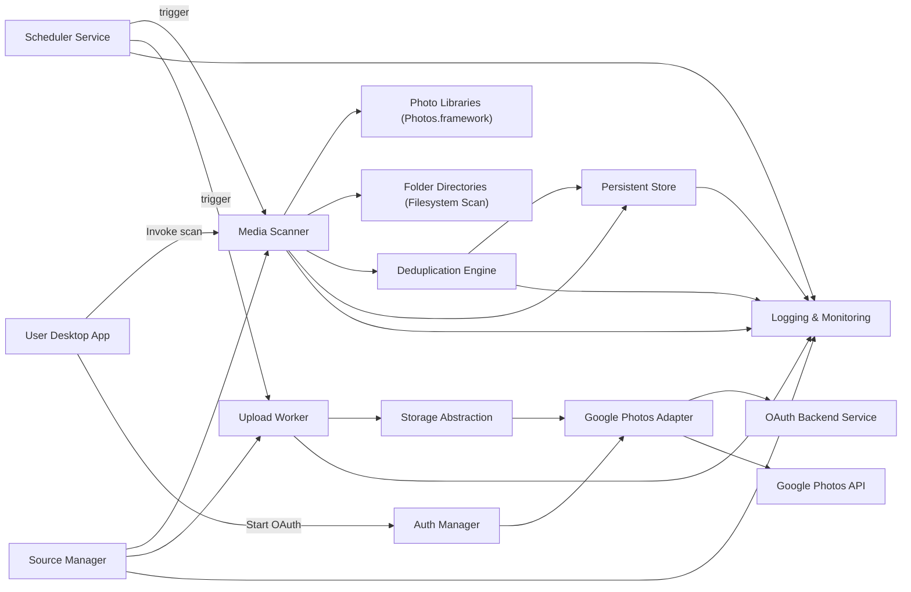
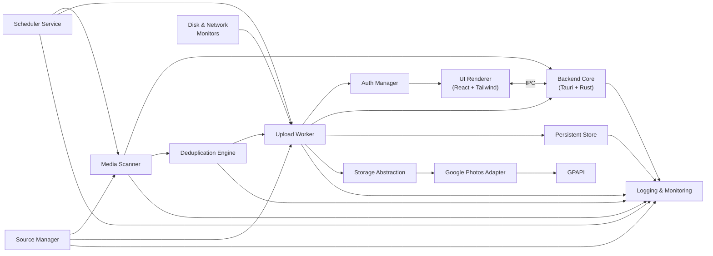
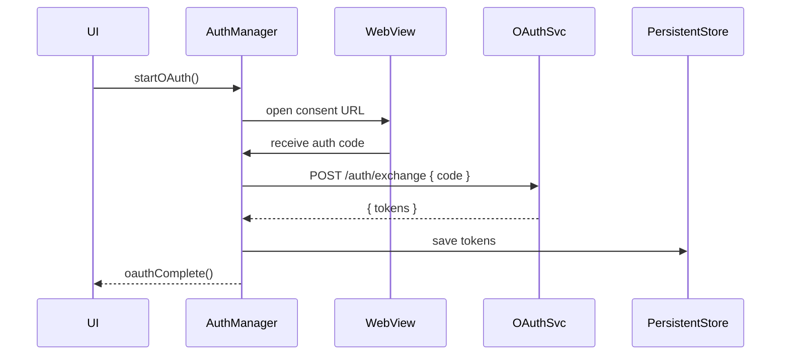
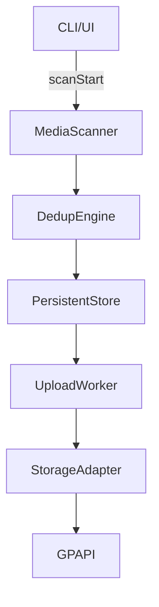
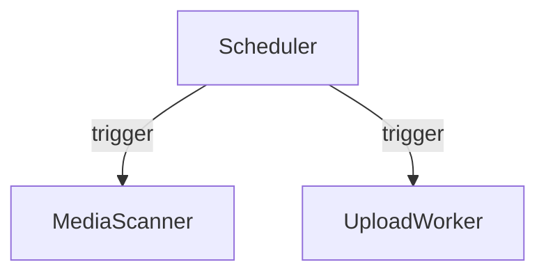

# Technical Design Document (High‑Level Design)
**Project:** Photo Migrator  
**Version:** 1.1.0  
**Author:** Sku Soda  
**Date:** April 20, 2025

---

## Table of Contents
1. [Purpose & Scope](#purpose--scope)  
2. [Architecture Overview](#architecture-overview)  
   1. [System Context](#system-context)  
   2. [Component Diagram](#component-diagram)  
3. [Module Descriptions](#module-descriptions)  
   1. [Media Scanner](#31-media-scanner)  
   2. [Upload Worker](#32-upload-worker)  
   3. [Auth Manager](#33-auth-manager)  
   4. [Persistent Store](#34-persistent-store)  
   5. [Settings Manager](#35-settings-manager)  
   6. [Disk & Network Monitors](#36-disk--network-monitors)  
   7. [UI Renderer](#37-ui-renderer)  
   8. [CLI Interface](#38-cli-interface)  
   9. [Deduplication Engine](#39-deduplication-engine)  
   10. [Logging & Monitoring](#310-logging--monitoring)  
   11. [Scheduler](#311-scheduler)  
   12. [Source Manager](#312-source-manager)  
   13. [Storage Abstraction Layer](#313-storage-abstraction-layer)  
4. [Data Design](#data-design)  
   1. [Logical Schema](#41-logical-schema)  
   2. [Configuration Export](#42-configuration-export)  
5. [Interface Specifications](#interface-specifications)  
   1. [Internal Backend ↔ UI IPC](#51-internal-backend--ui-ipc)  
   2. [Backend ↔ OAuth Service API](#52-backend--oauth-service-api)  
   3. [CLI Contracts](#53-cli-contracts)  
6. [Key Sequence Flows](#key-sequence-flows)  
   1. [OAuth2 Login](#61-oauth2-login)  
   2. [Scan → Upload](#62-scan--upload)  
   3. [Scheduled Sync](#63-scheduled-sync)  
7. [Non‑Functional Requirements](#7-non-functional-requirements)  
8. [Security Considerations](#8-security-considerations)  
9. [Deployment & Packaging](#9-deployment--packaging)  
10. [Dependencies & Constraints](#10-dependencies--constraints)  
11. [Glossary](#11-glossary)  

---

## 1. Purpose & Scope
This document provides a **High‑Level Design** for the Photo Migrator application, translating the PRD into an architectural blueprint. It defines modules, their interactions, data flows, and interfaces.

**In Scope:**  
- Desktop application (macOS & Windows) built with Tauri (Rust + WebView).  
- Headless CLI.  
- Secure OAuth2 via lightweight backend.  
- Local persistence (SQLite).

**Out of Scope:**  
- Mobile clients, media editing, non‑Google destinations, transcoding.

---

## 2. Architecture Overview  

### 2.1 System Context


### 2.2 Component Diagram


---

## 3. Module Descriptions  

### 3.1 Media Scanner
- **Language:** Rust + SwiftBridge for macOS  
- **Responsibility:**  
  - Discover files via Photos.framework for libraries and via filesystem scan for folder sources.  
  - Extract metadata (EXIF, MIME type, content hash, duration).  
  - Batch cloud-only downloads in a rolling window.  
  - Accept source definitions from Source Manager.  
  - Persist entries into SQLite.

### 3.2 Upload Worker
- **Language:** Rust  
- **Responsibility:**  
  - Consume batches from DB or triggered by Scheduler.  
  - Resumable uploads via Storage Abstraction.  
  - Deduplication by `sha256_hash`.  
  - Retry with exponential backoff.  
  - Update status & remote IDs.

### 3.3 Auth Manager
- **Language:** Rust + Tauri WebView  
- **Responsibility:**  
  - OAuth2 consent flows.  
  - Persist tokens to Persistent Store.

### 3.4 Persistent Store
- **Library:** rusqlite  
- **Responsibility:**  
  - Schema migrations  
  - Tables for `media_items`, `batches`, `settings`, `migrations`, `sources`, `schedules`, `cloud_configs`.

### 3.5 Settings Manager
- **Language:** Rust  
- **Responsibility:**  
  - Manage key/value configs (sync frequency, whitelist/blacklist).  
  - Provide configs to Scheduler and Source Manager.

### 3.6 Disk & Network Monitors
- **Crates:** sysinfo, tauri-network  
- **Responsibility:**  
  - Enforce thresholds and detect connectivity changes.

### 3.7 UI Renderer
- **Tech:** React, Tailwind, Tauri WebView  
- **Responsibility:**  
  - Display progress, settings, logs, manual controls.  
  - Expose scheduling and source management UI.

### 3.8 CLI Interface
See [5.3 CLI Contracts](#53-cli-contracts).

### 3.9 Deduplication Engine
- **Language:** Rust  
- **Responsibility:**  
  - Content and metadata deduplication.  
  - IPC: `findDuplicates`, `groupDuplicates`, `selectCanonical`.

### 3.10 Logging & Monitoring
- **Language:** Rust  
- **Responsibility:**  
  - Central logging, metrics (Prometheus), health checks.

### 3.11 Scheduler
- **Language:** Rust  
- **Responsibility:**  
  - Configure cron-like schedules for automatic sync.  
  - Trigger scan/upload workflows.

### 3.12 Source Manager
- **Language:** Rust  
- **Responsibility:**  
  - Define and manage sources (libraries & folders).  
  - Support whitelist and blacklist overrides.

### 3.13 Storage Abstraction Layer
- **Language:** Rust  
- **Responsibility:**  
  - Define generic trait/adapter for cloud providers.  
  - Implement Google Photos adapter; plan for S3, B2, Azure.  
  - **API:**  
    - `uploadFile(file, metadata, destinationConfig)`  
    - `createCollection(name, destinationConfig)`  
    - `configureDestination(providerConfig) -> DestinationConfig`  
    - `getQuota()`

---

## 4. Data Design  

### 4.1 Logical Schema
| Table             | Key Fields / Columns                                                                                                              |
|-------------------|-----------------------------------------------------------------------------------------------------------------------------------|
| **media_items**   | `id`, `media_type`, `mime_type`, `original_path`, `sha256_hash`, `status` ⏐ INDEX `sha256_hash`, FK `status` → `batches.status`   |
| **batches**       | `id`, `created_at`, `status`, `total_size`, `file_count` ⏐ INDEX `status`                                                            |
| **settings**      | `key`, `value`                                                                                                                    |
| **sources**       | `id`, `path`, `type` (library\|folder), `whitelist` bool, `blacklist` bool                                                         |
| **schedules**     | `id`, `cron_expr`, `enabled`                                                                                                      |
| **cloud_configs** | `id`, `provider` (google_photos\|s3\|b2\|azure), `config` JSON blob (destinationConfig + auth)                                    |
| **migrations**    | `id`, `applied_at`, `description`                                                                                                 |

### 4.2 Configuration Export
```json
{
  "disk_usage_cap_gb": 80,
  "upload_concurrency": 4,
  "bandwidth_limit_mbps": 5,
  "wifi_only": true,
  "skip_icloud_only": false,
  "sync_frequency": "0 * * * *",
  "sources": [
    {"path": "/Users/joe/Pictures/Library.photoslibrary", "type": "library"}
  ],
  "blacklist": [
    {"path": "/Users/joe/Pictures/Library.photoslibrary/Masters"}
  ]
}
```

---

## 5. Interface Specifications  

### 5.1 Internal Backend ↔ UI IPC
- **Protocol:** Tauri command/event system
- **Commands:**
  - Core: `scanStart`, `scanProgress`, `scanComplete`, `uploadStart`, `uploadProgress`, `uploadComplete`
  - Config: `getSettings`, `setSettings`, `getSources`, `addSource`, `removeSource`, `getSchedule`, `setSchedule`
  - Dedup: `findDuplicates`, `groupDuplicates`, `selectCanonical`
  - Storage: `uploadFile`, `createCollection`, `getQuota`
  - CloudConfig: `getCloudConfigs()`, `addCloudConfig`, `updateCloudConfig`, `removeCloudConfig`

### 5.2 Backend ↔ OAuth Service API
| Endpoint         | Method | Payload                 | Response                                      |
|------------------|--------|-------------------------|-----------------------------------------------|
| `/auth/exchange` | POST   | `{ code, redirect_uri }`| `{ access_token, refresh_token, expires_in }` |
| `/auth/refresh`  | POST   | `{ refresh_token }`     | `{ access_token, expires_in }`                |

### 5.3 CLI Contracts
```bash
# Source management
photo-migrator list-sources
photo-migrator add-source --path "/path/to/folder" --type folder
photo-migrator add-source --path "/Users/joe/Pictures/Library.photoslibrary" --type library
photo-migrator remove-source --id <source_id>

# Blacklist management (folders only)
photo-migrator list-blacklist
photo-migrator add-blacklist --path "/path/to/excluded/folder"
photo-migrator remove-blacklist --path "/path/to/excluded/folder"

# Storage backend management
photo-migrator list-backends
photo-migrator add-backend --provider <provider> --config '<JSON blob with destinationConfig + auth tokens>'
photo-migrator update-backend --id <backend_id> --config '<JSON blob with updated destinationConfig or auth tokens>'
photo-migrator remove-backend --id <backend_id>

# Core workflows
photo-migrator scan
photo-migrator plan
photo-migrator upload
photo-migrator resume
photo-migrator schedule --cron "0 * * * *"
```
---

## 6. Key Sequence Flows  

### 6.1 OAuth2 Login


### 6.2 Scan → Upload


### 6.3 Scheduled Sync


---

## 7. Non‑Functional Requirements
- **Performance:** ≥10 MB/s throughput.  
- **Reliability:** ≥99% first‑attempt success.  
- **Resource Usage:** Temp ≤80% cap; RAM idle ≤200 MB.  
- **Scalability:** 100 K items.  
- **Maintainability:** 90%+ unit tests; CI gates.  
- **Observability SLAs:** Log latency <100 ms; metrics ≥1/s/module.

## 8. Security Considerations
- **OAuth Secrets:** Backend-only.  
- **Token Storage:** Encrypted at rest.  
- **Logging:** No PII.  
- **Telemetry:** Opt-in only.

## 9. Deployment & Packaging
- **Desktop App:** Tauri Bundler → native .app/.exe; auto-update via Tauri Updater/S3.  
- **Backend:** Docker; AWS/GCP/Azure; TLS.

## 10. Dependencies & Constraints
- Rust ≥1.60, Tauri ≥1.0, Swift ≥5, SQLite 3.x, oauth2 crate ≥4.x.  
- Handle API quotas.  
- iCloud client installed.

## 11. Glossary
- **Batch:** Group of media items.  
- **Deduplication Engine:** Identifies duplicates.  
- **Scheduler:** Cron-based trigger service.  
- **Source Manager:** Manages sync sources (libraries/folders).  
- **Storage Abstraction:** Adapter interface for cloud providers.  
- **DuplicateGroup:** Set of duplicate files.  
- **pHash:** Perceptual hash algorithm.  
- **Hamming distance:** Bitwise difference metric.  
- **Observability:** System health via logs & metrics.  
- **Rolling‑Window Download:** Chunked download.  
- **Resumable Upload:** Chunked Google API upload.  
- **Staging Folder:** Temporary export area.  
- **Tauri:** Rust + WebView desktop framework.

