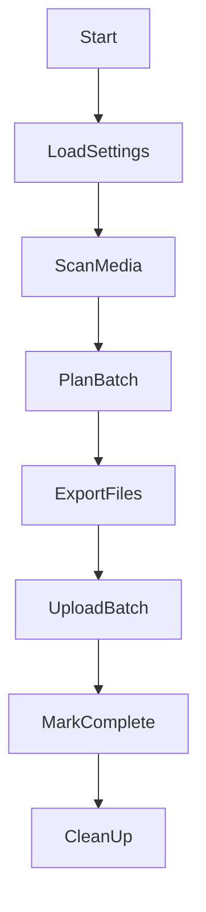

# Functional Specification Document (FSD)

## Project Name
**Photo Migrator**
*(Cross-Platform Apple Photos to Google Photos Uploader for Photos and Videos)*

## 1. Objective
Define the technical architecture, data structures, component behavior, module interfaces, error handling, and flows to implement the uploader application described in the PRD.

---

## 2. System Overview
The app is a desktop application built using Electron, React, and Node.js that uploads media from Apple Photos (macOS) or iCloud Photos folder (Windows) to Google Photos using Google's Library API. It handles large datasets, supports resumable uploads, provides user controls, and operates efficiently with limited disk and network resources.

---

## 3. Architecture Overview

### 3.1 High-Level Modules
| Module | Description |
|--------|-------------|
| `MediaScanner` | Discovers and extracts metadata from media files |
| `BatchPlanner` | Plans export and upload batches based on disk space |
| `Uploader` | Handles resumable upload flow with Google Photos API |
| `SQLiteStore` | Stores upload state and metadata |
| `SettingsManager` | Loads and persists user config |
| `DiskMonitor` | Monitors available disk space and enforces thresholds |
| `NetworkMonitor` | Detects WiFi, network status |
| `UIRenderer` | Renders the desktop UI using React |
| `AuthManager` | Manages OAuth2 flow with Google APIs |
| `SwiftBridge` | macOS native binary for Apple Photos integration |
| `Logger` | Provides structured logging with configurable levels |
| `Telemetry` | Optional telemetry for diagnostics (opt-in only) |

### 3.2 Security Considerations

#### 3.2.1 OAuth Credential Handling
Interacting with the Google Photos API requires OAuth 2.0 credentials (`CLIENT_ID` and `CLIENT_SECRET`). Handling the `CLIENT_SECRET` securely in a distributed desktop application is critical.

**Two-Phase Strategy:**
1.  **Initial Phase (MVP/Development):**
    *   **Tokens:** Access and Refresh tokens obtained from Google will be stored in a JSON file (`google-tokens.json`) within the application's protected user data directory (e.g., `~/.config/photo-migrator/` on macOS/Linux, `%APPDATA%/photo-migrator/` on Windows).
    *   **Client Secret:** For simplicity during initial development, the `CLIENT_ID` and `CLIENT_SECRET` **must be provided by the user** in a separate JSON file named `config.json` within the same configuration directory (e.g., `~/.config/photo-migrator/config.json`). This file is **required** for the application to authenticate. **This approach is NOT secure for a widely distributed application** as the secret resides readable on the user's machine.
      ```json
      // Example ~/.config/photo-migrator/config.json
      {
        "clientId": "YOUR_CLIENT_ID.apps.googleusercontent.com",
        "clientSecret": "YOUR_CLIENT_SECRET"
      }
      ```
2.  **Final Phase (Production/Distribution):**
    *   **Client Secret:** A **Backend Proxy Server** will be implemented. The Electron application will only handle the initial user authorization redirect and receive an *authorization code* from Google.
    *   This code will be sent to the secure backend server.
    *   The backend server, which securely stores the `CLIENT_SECRET`, will exchange the code and secret for the access/refresh tokens with Google.
    *   The backend returns only the *tokens* to the Electron application.
    *   **Rationale:** This ensures the `CLIENT_SECRET` is never exposed on the end-user's machine, adhering to security best practices.
    *   **Tokens:** The refresh token received from the backend proxy should ideally be stored securely using platform-specific mechanisms like macOS Keychain and Windows Credential Manager (via `keytar`). The access token can be kept in memory.
    *   **Client ID:** The `CLIENT_ID` is considered public and can remain embedded in the Electron application.

#### 3.2.2 User Data
*   Media file metadata and upload status are stored locally in an SQLite database within the application's user data directory.
*   Temporary copies of media files (during export/upload) are stored in a temporary directory and should be cleaned up promptly.
*   Appropriate file system permissions should be used for stored tokens and the database.

---

## 4. Data Models

### 4.1 SQLite Tables
```sql
CREATE TABLE media_items (
  id TEXT PRIMARY KEY,
  media_type TEXT CHECK(media_type IN ('photo', 'video')) NOT NULL,
  mime_type TEXT NOT NULL,
  original_path TEXT NOT NULL,
  local_copy_path TEXT,
  original_name TEXT NOT NULL,
  size_bytes INTEGER,
  creation_date TEXT,
  sha256_hash TEXT,
  visual_hash TEXT,
  pixel_size TEXT,
  duration_seconds REAL,
  frame_rate REAL,
  codec TEXT,
  status TEXT CHECK(status IN ('pending', 'exported', 'uploaded', 'failed', 'skipped')),
  retry_count INTEGER DEFAULT 0,
  last_attempt_at TEXT,
  google_photos_id TEXT,
  error_message TEXT
);

CREATE TABLE batches (
  id TEXT PRIMARY KEY,
  created_at TEXT,
  status TEXT CHECK(status IN ('planned', 'uploading', 'complete', 'failed')),
  total_size INTEGER,
  files_count INTEGER
);

CREATE TABLE settings (
  key TEXT PRIMARY KEY,
  value TEXT
);

-- Migration tracking table for schema versioning
CREATE TABLE migrations (
  id TEXT PRIMARY KEY,
  applied_at TEXT NOT NULL,
  description TEXT
);

-- Indexes for optimizing common queries
CREATE INDEX idx_media_status ON media_items(status);
CREATE INDEX idx_media_sha256_hash ON media_items(sha256_hash);
CREATE INDEX idx_media_type ON media_items(media_type);
CREATE INDEX idx_media_mime_type ON media_items(mime_type);
CREATE INDEX idx_media_retry_count ON media_items(retry_count);
CREATE INDEX idx_media_type_status ON media_items(media_type, status);
CREATE INDEX idx_media_mime_status ON media_items(mime_type, status);
CREATE INDEX idx_batches_status ON batches(status);
```

### 4.2 JSON Config Format (Stored via `electron-store`)
```json
{
  "maxDiskUsageGB": 80,
  "uploadSpeedLimitMbps": 5,
  "retryLimit": 5,
  "wifiOnly": true,
  "autoResume": true,
  "logLevel": "info",
  "telemetryOptIn": false,
  "videoUploadSettings": {
    "enabled": true,
    "maxSizeGB": 2,
    "priorityLevel": "normal"
  }
}
```

### 4.1.1 Migration Tracking
**Responsibility:** Track and apply incremental schema changes over time using versioned migrations.

**Migration Process:**
- On startup, the application initializes the database and creates the `migrations` table if it does not exist.
- Reads existing migration IDs from the `migrations` table.
- Executes each pending migration script in ascending order; each script is idempotent and encapsulates its own checks.
- Records the successful application of each migration in the `migrations` table with `id`, `applied_at`, and `description`.

**Migration Scripts Location:** `src/utils/migrations.ts`, e.g.:  
- `2023-04-20-add-is-in-icloud`: Adds `is_in_icloud` column to `media_items`.  
- Future migrations follow the same pattern with unique IDs and descriptions.

---

## 5. Component Specifications

### 5.1 MediaScanner
**Responsibility:** Discover all photos/videos, extract metadata, and queue for processing.

**macOS:**
- Swift executable runs: `photos-exporter --list` to return JSON list of photo/video metadata.
- Waits for iCloud media to download using polling with timeout (configurable, default 10 min)
- Shows "Waiting for iCloud" state in UI with countdown

**Windows:**
- Recursively scan `~/Pictures/iCloud Photos/Downloads`

**Metadata Extracted:**
- Filename, size, original creation date, format
- Media type (photo/video)
- For videos: duration, resolution, codec/container format
- SHA256 of binary file (including metadata)
- Visual hash (using pHash or aHash)
- Pixel dimensions
- MIME type

**Video-Specific Considerations:**
- Detect video formats compatible with Google Photos
- Track video duration for progress estimation
- Flag large videos that may require special handling

---

### 5.2 BatchPlanner
**Responsibility:** Dynamically generate upload batches based on disk space and batch size limits.

**Logic:**
- Ensure minimum 5GB free buffer always
- Estimate per-batch size: max = min(`maxDiskUsageGB`, `availableSpace - 5GB`)
- Skip any individual file larger than available staging space + 500MB
- Optionally segregate photos and videos into separate batches
- Prioritize photos over videos when space is limited (configurable)

**Outputs:**
- New batch record in DB
- List of file IDs to upload

---

### 5.3 Uploader
**Responsibility:** Upload a batch to Google Photos using resumable upload and batchCreate endpoints.

**Flow:**
1. Initiate upload URL using Google Photos API
2. Stream file in chunks with retry logic (exponential backoff)
3. On success, call `mediaItems:batchCreate`
4. Mark media item as uploaded

**Handles:**
- Token expiration and refresh
- Resume interrupted uploads
- Skip files after N retries
- Detect duplicates via hybrid fingerprinting
- Adjust timeout and chunk size for videos

**Duplicate Detection Strategy:**
- Primary: Exact `sha256_hash` match
- Secondary: If `sha256_hash` differs, fallback to comparing `visual_hash` + `pixel_size`
- Result: Warn or skip depending on config if visual match detected

**Video-Specific Considerations:**
- Use larger chunk sizes for videos (e.g., 5MB vs 1MB for photos)
- Implement longer timeouts for video uploads
- Provide video-specific progress calculation based on duration/size
- Handle video processing time on Google's side after upload

---

### 5.4 SQLiteStore
**Responsibility:** Persistent state of all files, batches, and retries.

**Methods:**
- `getPendingMedia(type?, limit?)`
- `updateMediaStatus(id, status, errorMessage)`
- `incrementRetryCount(id)`
- `getMediaByStatus(status, type?, limit?)`
- `getMediaById(id)`

### 5.5 DiskMonitor
**Responsibility:** Query available disk space using `diskusage` (cross-platform Node native module).

**Rules:**
- Warn and pause export if disk free < 10% or < 5GB
- Skip large files that won't fit + buffer
- Clean up staging folder after each batch
- Prioritize smaller files when disk space is constrained

**Video-Specific Considerations:**
- Implement special handling for videos exceeding specified size thresholds
- Track remaining space available for videos specifically
- Provide warnings when space is insufficient for video export

---

### 5.6 NetworkMonitor
**Responsibility:** Detects current connection type, online status.

**Tools:**
- `navigator.onLine`
- `systeminformation` package

**Triggers:**
- Pause on offline or non-WiFi if WiFi-only enabled
- Auto-resume on reconnect if autoResume = true
- Optional: Allow separate network policies for photos vs. videos

---

### 5.7 SettingsManager
**Responsibility:** Loads/saves app configuration, provides defaults.

**Library:** `electron-store`

**UI Validation:**
- Upload speed: 1–100 Mbps
- Max disk usage: 10–500 GB
- Retry limit: 1–20
- Video upload toggle: enabled/disabled
- Video size limit: 1MB–10GB

---

### 5.8 UIRenderer (React + Tailwind)
**Component Tree:**
```
<App>
 ├── <Header />
 ├── <ProgressDashboard />
 │   ├── <MediaProgress />
 │   └── <GlobalProgress />
 ├── <SettingsPanel />
 ├── <LogViewer />
 └── <TrayMenu />
```

**States:**
- Authenticated vs unauthenticated
- Upload active vs paused vs completed
- Network: online/offline, WiFi-only status
- iCloud waiting state with countdown
- Media type indicators (photo/video)

---

### 5.9 AuthManager
**Responsibility:** Google OAuth2 login + refresh

**Library:** `google-auth-library`

**Scopes:**
- `https://www.googleapis.com/auth/photoslibrary.appendonly`

**UX:**
- Login prompt on first launch
- Token refresh silently in background
- Expired token triggers re-auth + notification

**Storage:** Secure storage:
- macOS: Keychain
- Windows: Credential Manager
---

### 5.10 SwiftBridge
**Responsibility:** Native Swift helper tool to export or download iCloud media.

**Commands:**
- `photos-exporter --list`
- `photos-exporter --export id1 id2 ...`
- `photos-exporter --wait-for icloud-path`
- `photos-exporter --media-info id1 id2 ...` (for detailed video metadata)

**Communicates via:** stdout JSON

**Video-Specific Capabilities:**
- Extract video codec information
- Determine if video requires transcoding
- Report video playability status
- Extract thumbnail/poster frame

---

### 5.11 Logger
**Responsibility:** Centralized logging with structured levels

**Log Levels:**
- DEBUG, INFO, WARN, ERROR

**Rotation:** Daily log rotation with max size 10MB/log

**Storage Location:** `~/Library/Application Support/<app>` or `AppData/Local/<app>`

---

### 5.12 Telemetry
**Responsibility:** Optional error and usage reporting

**Defaults:** Disabled (opt-in only)
**Includes:** Anonymized usage stats, error traces
**Opt-In UI:** Toggle in SettingsPanel with "Learn More" link

---

## 6. Flows

### 6.1 Upload Flow


### 6.2 Retry Flow
- Failed upload → retry with backoff → max retries → mark as failed

### 6.3 Pause/Resume Flow
- Pause triggered by user, offline, low disk
- Resume triggered by user, reconnect, free disk

### 6.4 Video-Specific Flow
- Determine video compatibility → check size → prepare for upload → handle extended upload time → verify playback

---

## 7. Error Handling

| Scenario | Strategy |
|----------|----------|
| Disk full during export | Pause and show notification |
| API quota exceeded | Retry after cooldown |
| File not found | Mark as skipped, log error |
| Upload interrupted | Resume from chunk offset |
| Token expired | Refresh token automatically |
| iCloud media unavailable | Retry export for up to 10 minutes |
| Visual duplicate | Warn or auto-skip based on config |
| Unsupported video format | Warn user, mark as skipped, log format details |
| Video exceeds size limit | Offer options to skip or reduce quality |
| Video processing error (Google-side) | Report detailed error to user |

---

## 8. Build & Deployment

### 8.1 Tools
- **Build Tool**: Electron Builder
- **Package Targets**:
  - macOS `.dmg`
  - Windows `.exe` (NSIS)

### 8.2 Auto Start
- macOS: LaunchAgent plist
- Windows: Registry autostart key

### 8.3 Signing
- macOS: Developer ID Application cert
- Windows: EV Code Signing Certificate (optional)

---

## 9. Test Plan Overview
- Unit tests per module (`Uploader`, `BatchPlanner`, etc.)
- Integration test: scan → batch → upload
- Manual test cases:
  - Resume after reboot
  - iCloud download triggers
  - Large file chunk retry
  - Speed/bandwidth cap enforcement
  - OAuth token expiration
  - Visual duplicate match vs false positive
  - Video upload of various formats and sizes
  - Video playback verification

---

## 10. Future Improvements
- Multi-account support
- Album mapping and creation
- Selective album upload
- Prioritization (by face/tag/date)
- Localization and accessibility (a11y)
- Video transcoding options
- Advanced video metadata preservation

---

## 11. Glossary
- **Batch**: A group of media files exported and uploaded together
- **Staging Folder**: Temporary folder for pre-upload export
- **Resumable Upload**: Google API feature for chunked, retryable file uploads
- **Tray App**: Electron UI element in the system tray
- **Visual Hash**: A perceptual fingerprint based on image appearance (e.g. pHash)
- **SHA256**: A cryptographic hash of the binary file content including metadata
- **Media Item**: A photo or video to be uploaded
- **Codec**: Video encoding format (e.g., H.264, HEVC)
- **Container**: Media file format (e.g., MP4, MOV)


